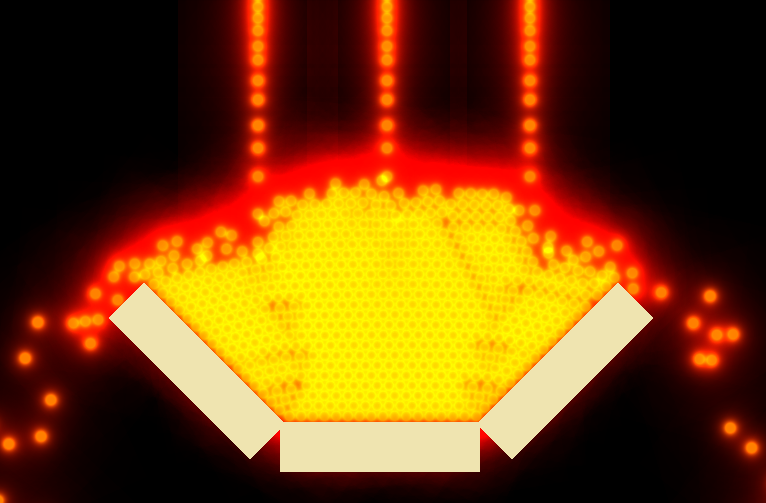

I used this project some time ago to calculate benchmark from shader and collision at the same time between Defold and a similar project in Godot, and I was astonished to see how well Defold was handled all of this.  
  
